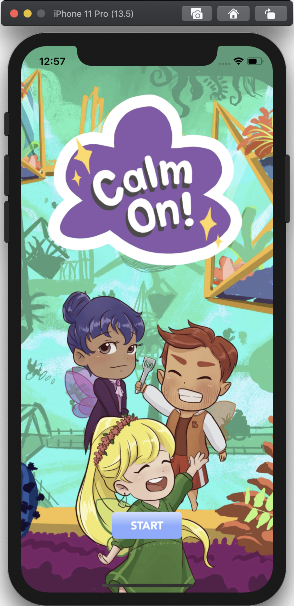
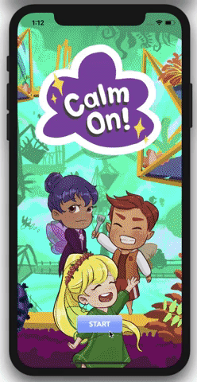
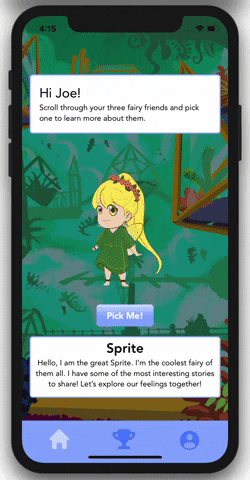
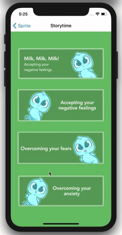
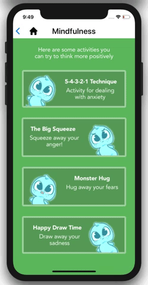

# Calm On!

Calm On! aims to create a fun and interactive experience that can educate youths (ages 6-11) to learn more about their feelings and mental health techniques. 
The Calm On app will provide users with fun emotion coaches in the form of our characters, Sprite, Aurora, and Flynn. Each coach has their own theme, personality, and activities that children can interact with to help them deal with the difficulties of living in quarantine.

 

## Background and Overview 

During COVID-19, there has been an increase in online gaming with youth & young adults as well as an increase of negative mental health effects. Inspiration for the app stemmed from looking for a way to promote children’s mental health awareness through gaming. As a team, we wanted to communicate mindfulness and coping strategies in a way that was fun and easy to digest for the young audience.

Calm On! aims to create a fun and interactive experience that can help youths (ages 6-11) learn more about their emotions and mental health through different ACT/CBT techniques. It also includes an integrated AI chatbot function that allows users to freely express their thoughts. We feel that the production of this app would prove valuable for the youth during these times as it addresses the mental distress that children, who may not necessarily have an outlet, are feeling. We’re striving to do this through interactively educating the children on healthy coping techniques as well as maintaining a daily schedule to attain a sense of stability in these challenging times.

## Functionality and MVP List

**1. User Authentication**
- Users must login or signup in order to use Calm On!'s features.

**2. Spirit Selection**
- Users can select a spirit or life coach.
  - Each spirit has different features, such as storytelling, mindfulness techniques, exercise, etc.

**3. Sprite**
- Users can access Sprite's storytime feature.

- Users can access Sprite's mindfulness feature.

## Technologies

Calm On! is created with React Native, Expo, MongoDB, and iOS Simulator.

## Group Members and Work Breakdown

* Clifford Yan - team lead
* Akif Saifi - back end
* Tiffany Chin - front end
* Jack Zhen - front end
